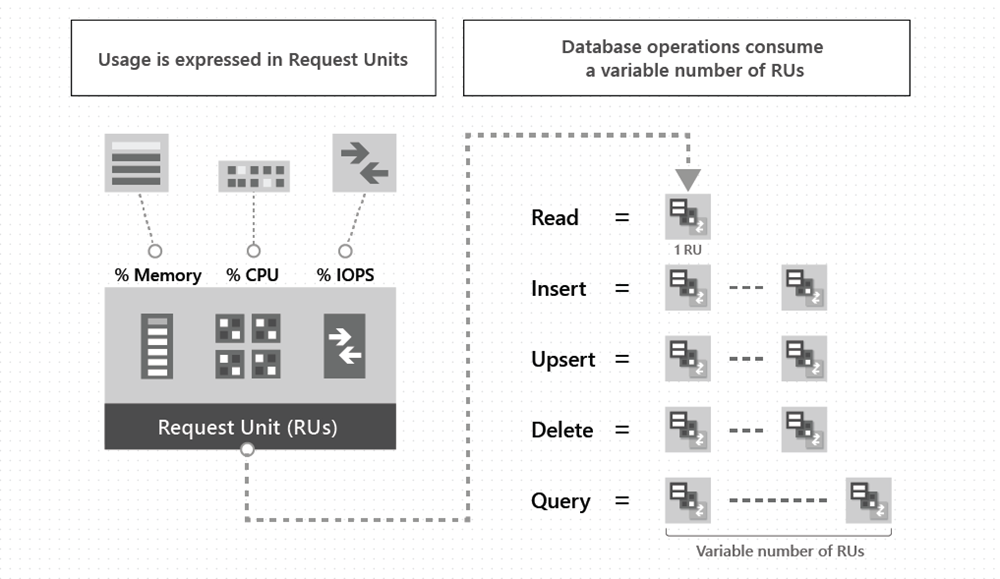
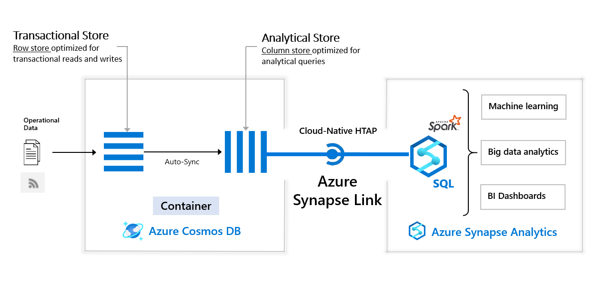
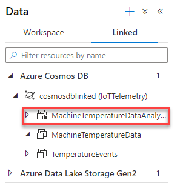
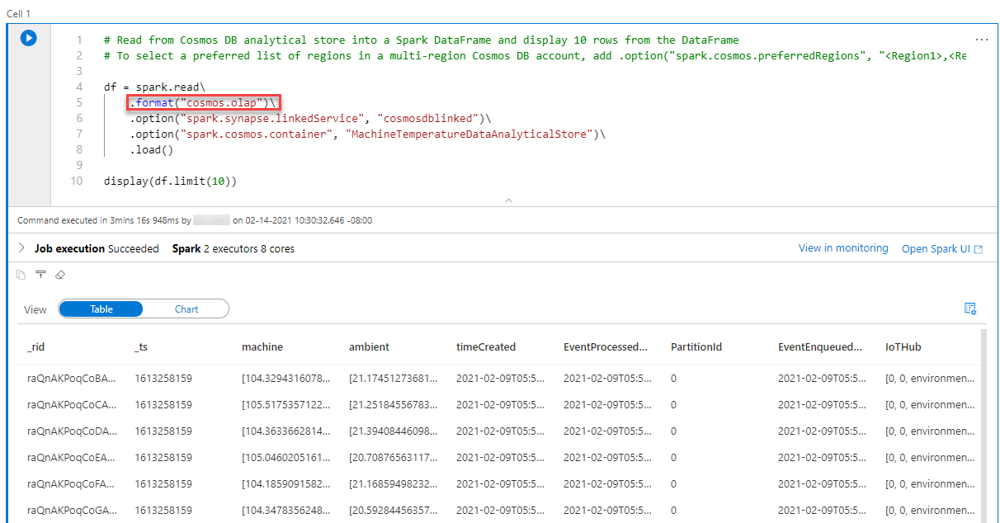
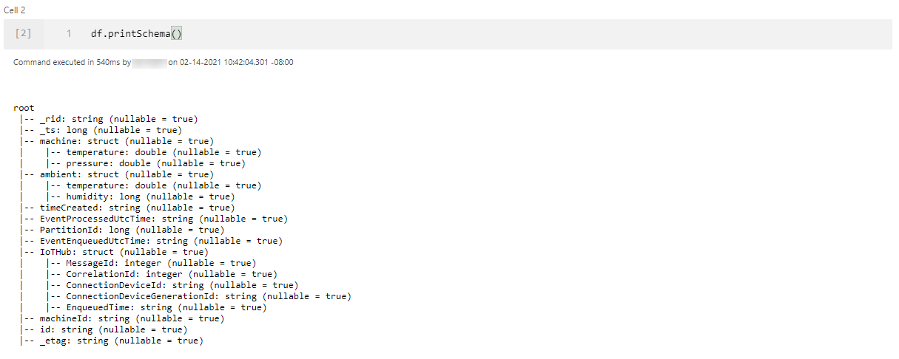
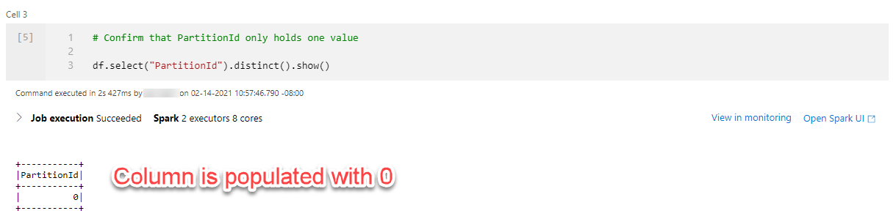
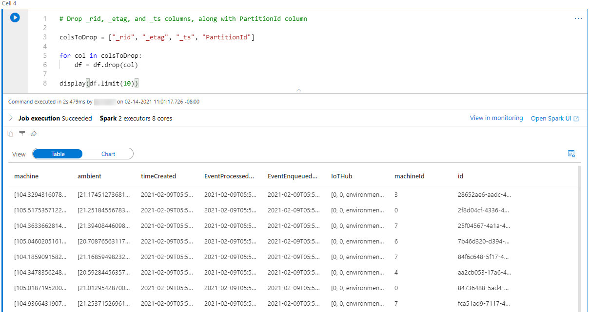
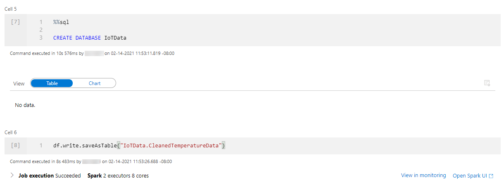
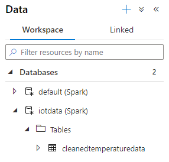
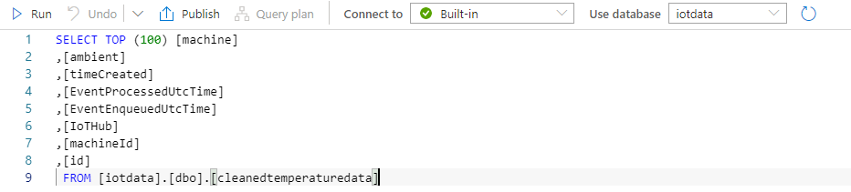

# Designing a Cosmos DB HTAP solution for an IoT Workload

## Introduction

In this blog post, you will learn more about the considerations of planning a Cosmos DB deployment for an IoT solution, and integrating it with Azure Synapse Analytics for analytical workloads. In this sample, an IoT Edge module running on a Linux VM will send simulated environmental data to Azure IoT Hub. The IoT Edge runtime on the VM runs containerized modules. In this post, a sample module will be used, but in a business deployment, module images are pulled from a container registry like Azure Container Registry. From there, Azure Stream Analytics will read data from IoT Hub using a *consumer group*. Stream Analytics will then write device data to two Azure Cosmos DB *SQL API* containers. Then, without an ETL job, data from one of the Cosmos DB containers will be analyzed in Azure Synapse Analytics, without harming the performance of the transactional workload.

### Implement the Solution

If you would like to follow the examples given in this post, refer to the instructions [here.](instructions.md) The document will run through the process of creating a resource group, IoT Hub, Cosmos DB account, and Azure Synapse workspace with an Apache Spark pool.

## Cosmos DB Specifics

Now that an IoT Edge module is transmitting data (potentially acting as an edge device transmitting data from multiple connected sensors), and the solution incorporates Stream Analytics to write the data to Cosmos DB, the solution's transactional data store, the solution must be designed to effectively take advantage of Cosmos DB's featureset. The features most critical to our scenario include scalability, high availability, and performance.

IoT device data is written to the `MachineTemperatureData` and `TemperatureEvents` containers using Stream Analytics, which uses the following query:

```sql
WITH 
DeviceDataWithMachineId AS 
(
    SELECT
        machine,
        ambient,
        timeCreated,
        EventProcessedUtcTime,
        PartitionId,
        EventEnqueuedUtcTime,
        IoTHub,
        UDF.getMachineId(0) AS machineId
    FROM
        EnvironmentMonitoringDevice TIMESTAMP BY timeCreated
)

SELECT * INTO TemperatureData FROM DeviceDataWithMachineId

SELECT 
    machineId,
    System.Timestamp() AS EventLoggedTime,
    AVG(machine.temperature) AS [TimeWindowTemp]
INTO 
    EventData
FROM 
    DeviceDataWithMachineId
GROUP BY 
    machineId, TumblingWindow(minute, 3)
HAVING
    [TimeWindowTemp] > 103.5
```

The first query (the one with the alias `DeviceDataWithMachineId`) simply appends a `machineId` with a random integer value from 0-9 to the JSON document. `machineId` is used as the partition key for both Cosmos DB containers. This means that the Cosmos DB solution is highly scalable, since each individual value of `machineId` has its own Cosmos DB logical partition, and each partition is capable of holding 10 GB. While there is only one device transmitting data in this example, this blog post mimics a scenario in which the IoT Edge device acts as a gateway for several (10) smaller devices. 

>**Note**: Readers may worry that this partitioning model means that the partition size limit will be hit quickly; however, a TTL value can be set for each individual document.

Now that the data from IoT Hub has a `machineId` value, a simple pass-through statement writes the device data into the `MachineTemperatureData` container, which is referenced by the `TemperatureData` Stream Analytics output.

The second query computes the average over a 3 minute period for the temperature values associated with each individual `machineId` value. Once it does so, and the average temperature value is above `103.5` degrees, it writes the `machineId`, a timestamp, and the average value to the `TemperatureEvents` container, referenced by the `EventData` Stream Analytics output. While it is not shown in this lab, *change feed* notifications for this container, coupled with an Azure Function App, Azure SignalR, and a web application, can be used to display the temperature alerts in real-time. You can learn more about this approach [here.](https://anthonychu.ca/post/cosmosdb-real-time-azure-functions-signalr-service/)

### Other Considerations

I would like to address the characteristics of Cosmos DB I discussed at the beginning of this section. Irrespective of the API that the database is provisioned to use, Microsoft quantifies performance using *Request Units*. Formally, one Request Unit is the cost of fetching a 1 KB item by its individual document ID and partition key (together, these two values are used to uniquely identify each item). Standard CRUD operations all have a cost measured in Request Units. In this example, the per-container Request Units are set manually, and can be increased manually using standard Azure management tools. However, for companies pursuing Azure IoT solutions, *autoscale* throughput is preferred, since throughput is scaled up and down automatically. This optimizes cost and simplifies development, and solely requires you to set the maximum throughput value. Read more about this approach [here.](https://docs.microsoft.com/en-us/azure/cosmos-db/provision-throughput-autoscale)



Another critical consideration for a Cosmos DB deployment is the *concistency level* choice. Concistency levels govern the relationship between the *concistency* and performance of reads, the latency of writes, and the required availability of the solution. The default concistency level, set at the Cosmos DB Account, is *Session* consistency. This means that if there is only one Azure region configured to write data, then a reader with the **same session token** as the writer will see the same data appear at the same time. In this example, Stream Analytics only writes to one region, so all readers, with new sessions, will see the writes appear in the correct order, though they will not see the writes appear at the exact moment they were written by the Stream Analytics job. This mode is ideal for the `TemperatureEvents` container, where the order of temperature events matters.

Note that you cannot set different concistency levels for different containers; however, you can override the default concistency level at the client- or request-level. Find more about this [here.](https://docs.microsoft.com/en-us/azure/cosmos-db/how-to-manage-consistency?tabs=portal%2Cdotnetv2%2Capi-async#override-the-default-consistency-level) However, for most applications, Session concistency provides low write latencies, high availbility, and excellent read throughput.

>**Note**: If your IoT solution has writes spanning multiple regions, and your Cosmos DB Account is kept at session concistency, you are not guaranteed that writes will appear in order. This is known as *eventual* concistency.

## Azure Synapse Link

In the instructions, Azure Synapse Link for Cosmos DB is enabled for the Cosmos DB Account. Synapse Link aims to provide a cloud-native HTAP solution. This means that your solution does not need to implement ETL mechanisms to move data from Cosmos DB (the transactional store) to data warehousing platforms. Synapse Link for Cosmos DB automatically replicates document data stored in containers to a column store known as the *Analytical Store*. The image below represents the relationship between Cosmos DB, the Analytical Store, and the various methods available to analyze data within Cosmos DB through Azure Synapse.



You are billed to use the Analytical Store. However, you do not provision throughput for it, as you might do with a Cosmos DB container. Note that the Analytical Store also supports global replication, so analysts can analyze and visualize data within Synapse by referencing the data store nearest to them.

### Working with Apache Spark

In Azure Synapse Analytics, the container with Analytical Store enabled, highlighted below, offers significant capabilities for analysis by both the built-in serverless SQL pool and the Spark cluster.



Suppose the developer is using Spark to perform Exploratory Data Analysis on the operational data. Synapse makes this process extremely simple (loading the data into a Spark `DataFrame`).



Line 5 indicates that the notebook is querying the Analytical Store (`cosmos.olap`). Line 10 displays 10 entries from the Cosmos DB container. Observe that the output resembles that of a standard relational database table. 

Typically, it is also a good idea to observe the datatypes of the columns.



The `_rid_`, `_ts`, and `_etag` properties are generated by Cosmos DB and do not enrich our data. Similarly, the `PartitionId` key only holds one value, 0. In this case, it makes sense to remove those columns.





This modified dataframe can be written as a Spark table, `CleanedTemperatureData`, in a new database, `IoTData`. Notice how Spark SQL code can be written in the notebook.



Once you complete this, navigate to the **Workspace** tab on the **Data** page. Navigate to **Databases > iotdata > Tables > cleanedtemperaturedata**, and select **New SQL script > Select TOP 100 rows**. 



Execute the query. Note that the serverless SQL Pool, available in all Synapse workspaces, is being used to query the table in the Spark database.



## Conclusion

In this blog post, you learned how to build an IoT solution that leverages Azure IoT Hub, Stream Analytics, Cosmos DB, and Synapse Analyics. This solution does not only provide temperature alerts (`TemperatureEvents` Cosmos DB container), but also make IoT device data available for consumption in Apache Spark and the serverless SQL pool in the Synapse Analytics Workspace.

There are certainly other avenues to take with this sample application. First, you can create a Power BI dashboard to visualize the device data. You can learn more about this approach [here.](https://docs.microsoft.com/en-us/azure/synapse-analytics/spark/apache-spark-to-power-bi#connect-to-power-bi) In addition, I demonstrated an example of querying the Cosmos DB Analytical Store using Azure Synapse Analytics. However, you can also use Spark structured streaming, which leverages Cosmos DB change feed notifications. Note that this operation does not use the Analytical Store and thus costs Cosmos DB throughput. 