# Cosmos DB for IoT Instructions

This document accompanies the [post]() written about deploying Cosmos DB for an IoT solution.

## Deploy an IoT Edge Module to a Linux VM

In this section, an IoT Hub and a Linux VM running a Simulated Temperature Sensor module will be created. This document requires you to have an active Azure Subscription.

1. Open Azure cloud shell. You can find it in the upper right-hand corner of [Azure portal](portal.azure.com). [Sign in](https://docs.microsoft.com/en-us/cli/azure/authenticate-azure-cli) to the CLI and [set subscription information.](https://docs.microsoft.com/en-us/cli/azure/manage-azure-subscriptions-azure-cli)

    

2. Once Azure cloud shell opens, issue the following sequence of commands to provision a resource group and a standard tier IoT Hub. You can also create a free tier IoT Hub, but note that there can only be one per subscription and it is possible that the IoT Edge module will exceed the message quota for the free tier module. These commands also require you to provide a three-letter suffix to avoid any name conflicts.

    ```bash
    suffix="[YOUR SUFFIX]"
    resourceGroup="cosmosdbiot-$suffix"
    location="[A LOCATION NEAR YOU (westus in my case)]"
    iotHubName="cosmosdbiothub-$suffix"

    az group create -n $resourceGroup -l $location
    az iot hub create -g $resourceGroup -n $iotHubName --sku S1 --partition-count 2
    ```

    >**Note**: Change *--sku* to *F1* for a free tier IoT Hub instance.

3. Once the IoT Hub provisions, we will need to create an IoT Edge device. Then, the second command will store the edge device's connection string in a variable for future reference. This connection string will be provided to the IoT Edge runtime's configuration. If you are asked to install the *azure-iot* extension, allow it to be installed.

    ```bash
    iotDeviceName="environmentmonitoring"

    az iot hub device-identity create --device-id $iotDeviceName --edge-enabled --hub-name $iotHubName
    edgeConnectionString=$(az iot hub device-identity connection-string show --device-id $iotDeviceName --hub-name $iotHubName -o tsv)
    ```

4. To simplify the process of deploying an IoT Edge device, Microsoft has provided an ARM template to create a Linux VM configured with the IoT Edge runtime. In the command below, ensure that you substitute `[CHOOSE A SECURE PASSWORD]` with a password of your choice.

    ```bash
    az deployment group create \
    --resource-group $resourceGroup \
    --template-uri "https://aka.ms/iotedge-vm-deploy" \
    --parameters dnsLabelPrefix="$iotDeviceName-$suffix" \
    --parameters adminUsername='azureUser' \
    --parameters deviceConnectionString=$edgeConnectionString \
    --parameters authenticationType='password' \
    --parameters adminPasswordOrKey="[CHOOSE A SECURE PASSWORD]"
    ```

5. Once the ARM template deploys, you will receive a JSON output. Locate the SSH connection information, and run that command in the cloud shell.

    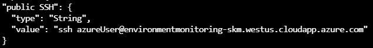

6. Once you SSH into the VM, run the following command to verify that the edge runtime is functional.

    ```bash
    sudo systemctl status iotedge
    ```

    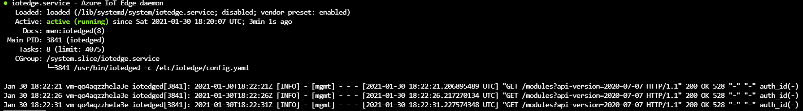

7. Navigate to your Edge device in Azure portal. To do this, locate the IoT Hub you created earlier and select **IoT Edge** under **Automatic Device Management**. Select the **environmentmonitoring** device.

    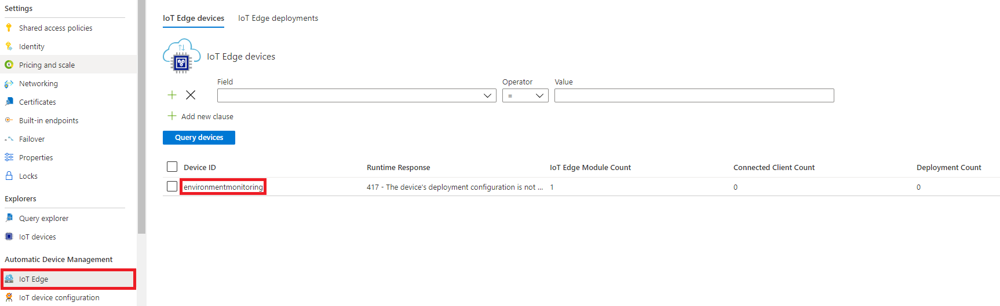

8. Select **Set modules**. Then, select **+ Add** under **IoT Edge Modules**. Select **IoT Edge Module**. Enter `SimulatedTemperatureSensor` as the **IoT Edge Module Name**. Set `mcr.microsoft.com/azureiotedge-simulated-temperature-sensor:1.0` as the **Image URI**.

    >**Note**: You may recognize that this is an existing Azure Marketplace module. However, the Marketplace module does not allow us to set the `MessageCount` environment variable, so we are provisioning it manually.

9. Navigate to the **Environment Variables** tab. Add an environment variable called `MessageCount`, and set its value to `-1`. Select **Add**.

9. Select **Next: Routes >**. The first route, **route**, moves messages from all modules on the device to **$upstream**, the IoT Hub. The second route, **SimulatedTemperatureSensorToIoTHub**, only routes messages from the **SimulatedTemperatureSensor** module. Feel free to delete **route**. Then, select **Review + create** and **Create**.

10. Navigate back to your VM. Run `sudo iotedge list` to see the modules running on your device. If you see the following, you are ready to continue to the next part.

    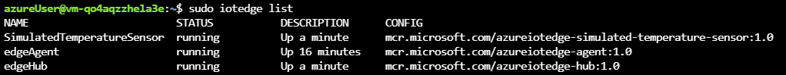

## Provision Azure Stream Analytics

Azure Stream Analytics will ingest data from the Azure IoT Hub instance you created. The Article document provides more technical information about the role that Stream Analytics plays.

1. First, we will need to create a new **Consumer Group** in IoT Hub. It is best-practice to create one Consumer Group per Stream Analytics input. In Azure portal, select your IoT Hub. Then, under **Settings**, select **Built-in endpoints**. Add a consumer group called **StreamAnalytics**. Azure will automatically save your submission. 

    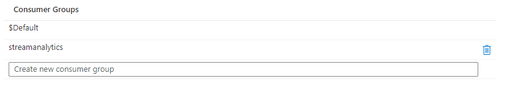

2. In Azure portal, select **+ Create a resource**. Search for **Stream Analytics job**. Select **Create**. Populate the form with the following information, and then select **Create**.

    - **Job name**: **iottocosmosdb**
    - **Subscription**: Choose your Azure subscription
    - **Resource group**: Choose the resource group you created previously
    - **Location**: Choose the same location that you provisioned your other resources in
    - **Hosting environment**: **Cloud**
    - **Streaming units**: 3
    - **Secure all private data assets needed by this job in my Storage account**: **Unchecked**

    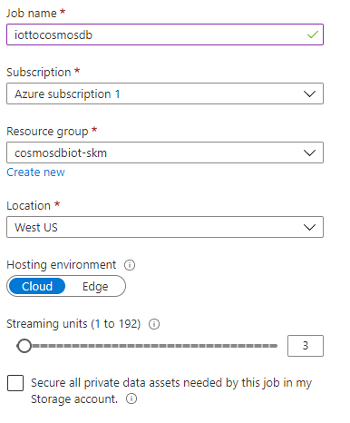

3. Navigate to your Stream Analytics job. Under **Job topology**, select **Inputs**. Under **+ Add stream input**, select **IoT Hub**. Provide the following information. Then, select **Save**. Azure will also validate your input; ensure that validation succeeds.

    - **Input alias**: **EnvironmentMonitoringDevice**
    - **Subscription**: Your subscription
    - **IoT Hub**: Choose the **cosmosdbiothub-SUFFIX** IoT Hub
    - **Consumer group**: **streamanalytics**
    - **Shared access policy name**: **iothubowner**
    - **Endpoint**: **Messaging**
    - **Event serialization format**: **JSON**
    - **Encoding**: **UTF-8**
    - **Event compression type**: **None**

    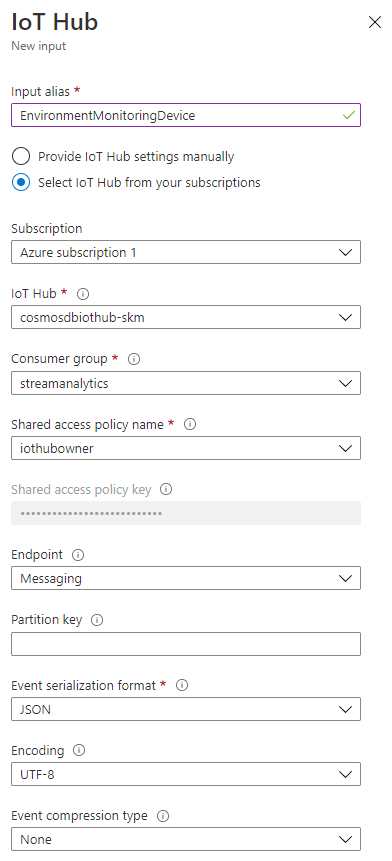

4. When Cosmos DB is provisioned, *machineId* will be used as the partition key, to simulate a factory environment in which multiple IoT devices (attached to multiple machines) send data to the IoT Edge module. However, in its current configuration, there is no *machineId* field in the JSON documents that are being sent. So, under **Job topology**, select **Functions**. Select **+ Add** and **Javascript UDF**. Then, insert the following code:

    ```js
    function main(arg1) {
        return Math.floor(Math.random() * 10);
    }
    ```

    >**Note**: You may notice that `arg1` is not used in the UDF. However, at least one parameter must be present for the UDF to save.

5. Save the UDF with the **Function alias** `getMachineId` and the **Output type** `bigint`.

    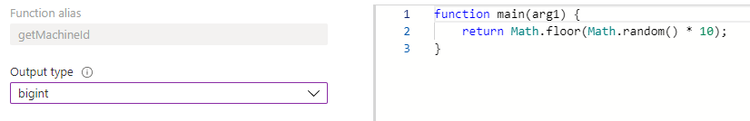

## Provision Azure Cosmos DB

You will provision an Azure Cosmos DB account, database, and container in Azure portal.

### Creating a Cosmos DB Account

1. Select **+ Create a resource** in the portal. Search for **Azure Cosmos DB**. Select **Create**.

2. On the **Create Azure Cosmos DB Account** window, provide the following information. Then, select **Review + create**.

    | Name        | Value       |
    | ----------- | ----------- |
    | Subscription      | Same Azure subscription you've been using throughout the lab.       |
    | Resource Group   | Same resource group where you've housed the other lab resources.        |
    | Account Name   | `cosmosdb-account-[SUFFIX]`        |
    | API   | `Core (SQL)`       |
    | Notebooks (Preview)   | `Off`       |
    | Location   | Same location where your other resources are housed.       |
    | Capacity mode   | `Provisioned throughput`       |
    | Apply Free Tier Discount   | Your choice.       |
    | Account Type   | `Non-Production`      |
    | Geo-Redundancy  | `Disable`     |
    | Multi-region Writes  | `Disable`      |

    >**Note**: In a production deployment, there are certainly features you would want to enable, like **Geo-Redundancy**. We are not enabling them for the sake of cost. You can find more information about these options [here.](https://docs.microsoft.com/en-us/azure/cosmos-db/create-cosmosdb-resources-portal)

### Creating a Database and a Container

1. Once your Cosmos DB account provisions, navigate to the resource. Then, select **Data Explorer**. 

2. Select **New Database**.

3. Set the **Database id** to `IoTTelemetry`. Make sure to uncheck **Provision throughput**; we will provision throughput at the container-level. Select **OK**.

4. In **Data Explorer**, select the three dots next to the `IoTTelemetry` database, and select **New Container**. Set the **Container id** to `MachineTemperatureData` and **Partition key** to `/machineId`. Ensure that **Throughput** is set to `400 RU/s`. Select **OK**.

    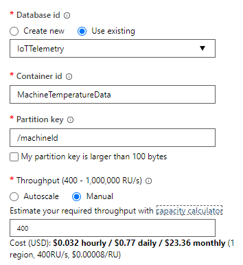

    >**Note**: Microsoft recommends that you provision *unlimited* containers, which have no storage limits, for streaming data. Provisioning an unlimited container would require the container to have a throughput of at least 1,000 RU/s. We are not enabling that feature for the sake of cost.

5. Create another container in the same database called `TemperatureEvents`. The **Partition key** is again `/machineId`, and ensure that the **Throughput** is `400 RU/s`.

### Configure an Output for Stream Analytics

1. Navigate to your Stream Analytics job, and under **Job topology**, select **Outputs**. 

2. **+ Add** an output, and select **Cosmos DB**.

3. Enter `TemperatureData` as the **Output alias**, and select the Cosmos DB account you created for this lab. Select the `IoTTelemetry` database and `MachineTemperatureData` as the **Container name**. Then, select **Save**.

    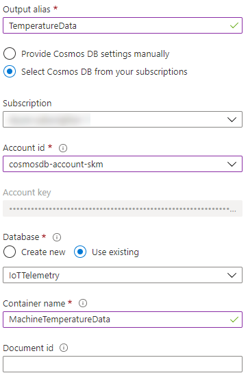

4. Repeat steps 2-3, but use `EventData` as the **Output alias** and `TemperatureEvents` as the **Container name**. Select **Save**.

## Starting the Stream Analytics Job

1. Navigate to **Query** under **Job topology**. 

2. Enter the following query. Ensure that there are no errors in the code editor.

    ```sql
    WITH 
    DeviceDataWithMachineId AS 
    (
        SELECT
            machine,
            ambient,
            timeCreated,
            EventProcessedUtcTime,
            PartitionId,
            EventEnqueuedUtcTime,
            IoTHub,
            UDF.getMachineId(0) AS machineId
        FROM
            EnvironmentMonitoringDevice TIMESTAMP BY timeCreated
    )

    SELECT * INTO TemperatureData FROM DeviceDataWithMachineId

    SELECT 
        machineId,
        System.Timestamp() AS EventLoggedTime,
        AVG(machine.temperature) AS [TimeWindowTemp]
    INTO 
        EventData
    FROM 
        DeviceDataWithMachineId
    GROUP BY 
        machineId, TumblingWindow(minute, 3)
    HAVING
        [TimeWindowTemp] > 103.5
    ```

3. Select **Save query**. Then, navigate to the **Overview** tab and select **Start**. Select **Start** again.

    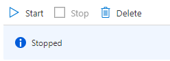

4. Navigate to Azure Cosmos DB, and select **Data Explorer**. Select the **TemperatureEvents** container and then select **Items**. You should see some events logged (you may need to refresh).

    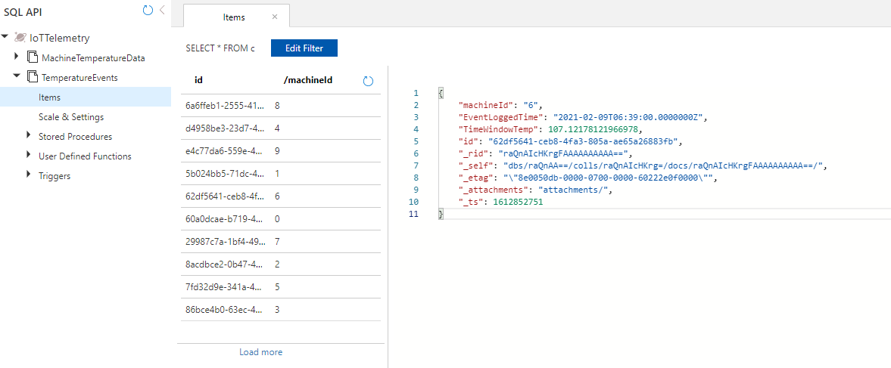

    >**Note**: If you do not see any output, please adjust the aggregation window time (currently set to 3 minutes) and the value in the HAVING clause. You can also use the **Test query** tool of the Query editor to visualize results.

## Creating Azure Synapse Link

To enable Azure Synapse Link, you will need to first provision an Azure Synapse workspace with an Apache Spark pool. Then, you can migrate data from the `MachineTemperatureData` container to a new container with Analytical Store enabled.

### Provisioning Azure Synapse Analytics

1. In the portal, select **+ Create a resource** and search for **Azure Synapse Analytics**. Then, select **Create**.

2. Populate the **Create Synapse Workspace** form with the following information. Also verify that your Azure account is given the **Storage Blob Data Contributor** role for your ADLS Gen2 account.

    | Name        | Value       |
    | ----------- | ----------- |
    | Subscription      | Same Azure subscription you've been using throughout the lab.       |
    | Resource Group   | Same resource group where you've housed the other lab resources.        |
    | Managed Resource Group   | Leave it blank.        |
    | Workspace name   | `cosmosdb-synapse-[SUFFIX]`        |
    | Region   | Same location where your other resources are housed.       |
    | ADLS Account name   | Select **Create new** and enter `cosmosdbiotadls[SUFFIX]`       |
    | File system name   | Select **Create new** and enter `synapsefs`        |

3. Select **Review + create**. Once validation passes, select **Create**.

### Provisioning Apache Spark Pools

1. Navigate to your resource group and select your Synapse workspace. On the **Overview** tab, select the **Workspace web URL**.

2. Navigate to the **Manage** hub and select **Apache Spark pools**. Then, select **+ New**.

    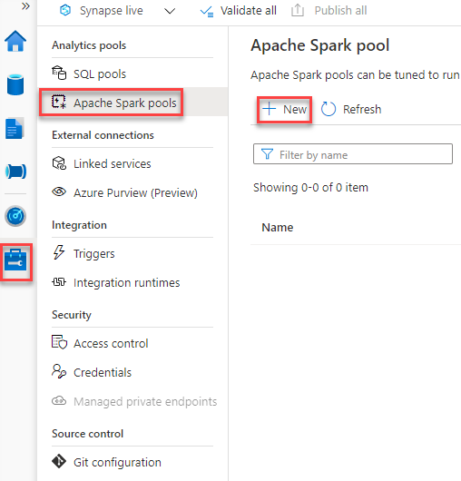

3. On the **Create Apache Spark pool** page, provide the following information. Then, select **Review + create** and **Create**.

    | Name        | Value       |
    | ----------- | ----------- |
    | Apache Spark pool name     | `cosmosdbspark`       |
    | Node size   | `Small (4 vCores / 32 GB)`        |
    | Autoscale   | `Disabled`        |
    | Number of nodes   | `3` (the minimum)       |

### Creating a Linked Service for Cosmos DB

1. Under **External connections** (still in the Manage hub), select **Linked services**. Select **+ New** and **Azure Cosmos DB (SQL API)**. 

2. On the **New linked service** window, provide the following values. Then, select **Test connection** at the lower right hand corner of the page. Then, select **Create**.

    | Name        | Value       |
    | ----------- | ----------- |
    | Name     | `cosmosdblinked`       |
    | Azure subscription   | Your Azure subscription        |
    | Azure Cosmos DB account name   | `cosmosdb-account-[SUFFIX]`        |
    | Database name   | `IoTTelemetry`       |

### Creating a new Cosmos DB Container with Analytical Store Enabled

1. Navigate to your Cosmos DB resource, and select **Data Explorer**. At the upper left-hand corner of the page, select the Synapse logo, and wait for Azure Synapse Link to be enabled.

2. Create a new container and specify the following information. Then, select **OK**.

    | Name        | Value       |
    | ----------- | ----------- |
    | Database id     | `IoTTelemetry`       |
    | Container id   | `MachineTemperatureDataAnalyticalStore`        |
    | Partition key   | `/machineId`        |
    | Throughput   | Manual / `400 RU/s`       |
    | Analytical store   | `On`       |

3. Download the [DocumentDB Migration Tool.](https://www.microsoft.com/en-us/download/details.aspx?id=46436)

4. Extract the zip file to a folder of your choosing (I chose `C:\Cosmos DB Migration Tool`). 

5. Navigate to that folder and launch `dtui.exe`. 

    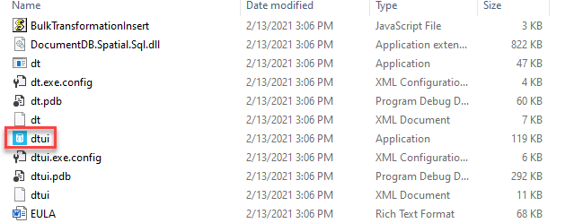

6. Navigate to Cosmos DB. Select **Keys**, and copy the value of **Primary Connection String**. Then, in the **Specify source information** page of the DocumentDB Migration Tool, select **DocumentDB** as the source. Paste your connection string, making sure to append `Database=IoTTelemetry;` to the end of the value. Set `MachineTemperatureData` as the collection. Select **Next**.

    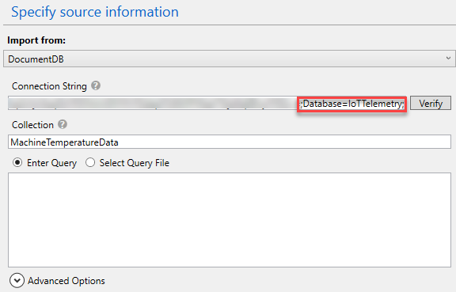

7. On the **Specify target information** page, ensure that you export to **Document DB - Sequential record import**. Specify the same connection string (with the database). Set the collection as `MachineTemperatureDataAnalyticalStore`. Set `/machineId` as the **Partition key**. Select **Next** again.

    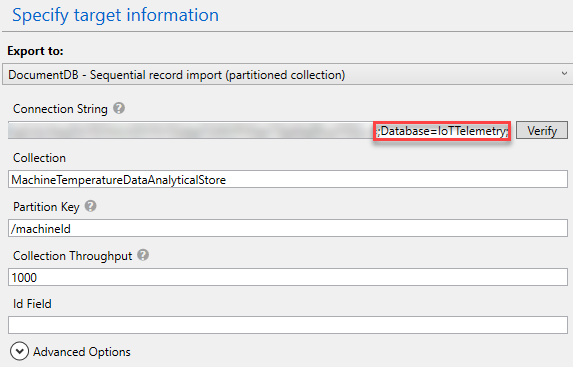

8. Skip to the **Confirm import settings** page, and select **Import**. Wait for the process to complete.

### Point Stream Analytics to the New Container
