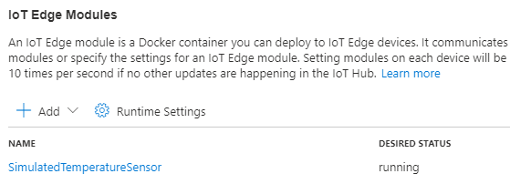

# Cosmos DB for IoT Instructions

This document accompanies the [post]() written about deploying Cosmos DB for an IoT solution.

## Deploy an IoT Edge Module to a Linux VM

In this section, an IoT Hub and a Linux VM running a Simulated Temperature Sensor module will be created. This document requires you to have an active Azure Subscription.

1. Open Azure cloud shell. You can find it in the upper right-hand corner of [Azure portal](portal.azure.com). [Sign in](https://docs.microsoft.com/en-us/cli/azure/authenticate-azure-cli) to the CLI and [set subscription information.](https://docs.microsoft.com/en-us/cli/azure/manage-azure-subscriptions-azure-cli)

    

2. Once Azure cloud shell opens, issue the following sequence of commands to provision a resource group and a standard tier IoT Hub. You can also create a free tier IoT Hub, but note that there can only be one per subscription and it is possible that the IoT Edge module will exceed the message quota for the free tier module. These commands also require you to provide a three-letter suffix to avoid any name conflicts.

    ```bash
    suffix="[YOUR SUFFIX]"
    resourceGroup="cosmosdbiot-$suffix"
    location="[A LOCATION NEAR YOU (westus in my case)]"
    iotHubName="cosmosdbiothub-$suffix"

    az group create -n $resourceGroup -l $location
    az iot hub create -g $resourceGroup -n $iotHubName --sku S1 --partition-count 2
    ```

    >**Note**: Change *--sku* to *F1* for a free tier IoT Hub instance.

3. Once the IoT Hub provisions, we will need to create an IoT Edge device. Then, the second command will store the edge device's connection string in a variable for future reference. This connection string will be provided to the IoT Edge runtime's configuration. If you are asked to install the *azure-iot* extension, allow it to be installed.

    ```bash
    iotDeviceName="environmentmonitoring"

    az iot hub device-identity create --device-id $iotDeviceName --edge-enabled --hub-name $iotHubName
    edgeConnectionString=$(az iot hub device-identity connection-string show --device-id $iotDeviceName --hub-name $iotHubName -o tsv)
    ```

4. To simplify the process of deploying an IoT Edge device, Microsoft has provided an ARM template to create a Linux VM configured with the IoT Edge runtime. In the command below, ensure that you substitute `[CHOOSE A SECURE PASSWORD]` with a password of your choice.

    ```bash
    az deployment group create \
    --resource-group $resourceGroup \
    --template-uri "https://aka.ms/iotedge-vm-deploy" \
    --parameters dnsLabelPrefix="$iotDeviceName-$suffix" \
    --parameters adminUsername='azureUser' \
    --parameters deviceConnectionString=$edgeConnectionString \
    --parameters authenticationType='password' \
    --parameters adminPasswordOrKey="[CHOOSE A SECURE PASSWORD]"
    ```

5. Once the ARM template deploys, you will receive a JSON output. Locate the SSH connection information, and run that command in the cloud shell.

    

6. Once you SSH into the VM, run the following command to verify that the edge runtime is functional.

    ```bash
    sudo systemctl status iotedge
    ```

    

7. Navigate to your Edge device in Azure portal. To do this, locate the IoT Hub you created earlier and select **IoT Edge** under **Automatic Device Management**. Select the **environmentmonitoring** device.

    

8. Select **Set modules**. Then, select **+ Add** under **IoT Edge Modules**. Select **Marketplace Module**. Search for **Simulated Temperature Sensor**. The image below demonstrates the end result of this process. 

    

9. Select **Next: Routes >**. The first route, **route**, moves messages from all modules on the device to **$upstream**, the IoT Hub. The second route, **SimulatedTemperatureSensorToIoTHub**, only routes messages from the **SimulatedTemperatureSensor** module. Feel free to delete **route**. Then, select **Review + create** and **Create**.

10. Navigate back to your VM. Run `sudo iotedge list` to see the modules running on your device. If you see the following, you are ready to continue to the next part.

    

## Provision Azure Stream Analytics

Azure Stream Analytics will ingest data from the Azure IoT Hub instance you created. The Article document provides more technical information about the role that Stream Analytics plays.

1. First, we will need to create a new **Consumer Group** in IoT Hub. It is best-practice to create one Consumer Group per Stream Analytics input. In Azure portal, select your IoT Hub. Then, under **Settings**, select **Built-in endpoints**. Add a consumer group called **StreamAnalytics**. Azure will automatically save your submission. 

    

2. In Azure portal, select **+ Create a resource**. Search for **Stream Analytics job**. Select **Create**. Populate the form with the following information, and then select **Create**.

    - **Job name**: **iottocosmosdb**
    - **Subscription**: Choose your Azure subscription
    - **Resource group**: Choose the resource group you created previously
    - **Location**: Choose the same location that you provisioned your other resources in
    - **Hosting environment**: **Cloud**
    - **Streaming units**: 3
    - **Secure all private data assets needed by this job in my Storage account**: **Unchecked**

    

3. Navigate to your Stream Analytics job. Under **Job topology**, select **Inputs**. Under **+ Add stream input**, select **IoT Hub**. Provide the following information. Then, select **Save**. Azure will also validate your input; ensure that validation succeeds.

    - **Input alias**: **EnvironmentMonitoringDevice**
    - **Subscription**: Your subscription
    - **IoT Hub**: Choose the **cosmosdbiothub-SUFFIX** IoT Hub
    - **Consumer group**: **streamanalytics**
    - **Shared access policy name**: **iothubowner**
    - **Endpoint**: **Messaging**
    - **Event serialization format**: **JSON**
    - **Encoding**: **UTF-8**
    - **Event compression type**: **None**

    


